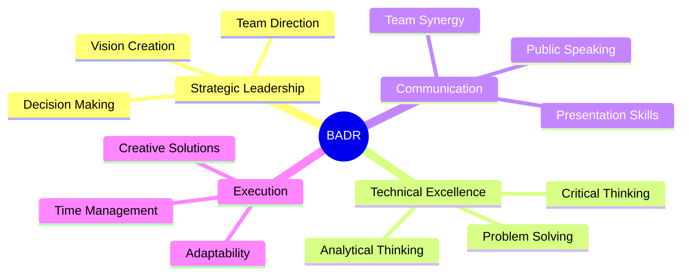

<div align="center">

<!-- HEADER WITH ANIMATED GRADIENT -->


</div>

---

## 🌟 WHO AM I?

```typescript
const badr: Developer = {
  location: "Alexandria, Egypt 🇪🇬",
  role: "Software Engineer & Full-Stack Developer",
  mindset: "Visionary | Architect | Problem Solver",
  philosophy: "Code is poetry, architecture is art",
  currentFocus: ["Enterprise Applications", "Scalable Systems", "IoT Solutions"],
  lifeGoal: "Build systems that change lives, create experiences that last forever",
  motto: "Be a Leader, History does not remember soldiers"
};
```

<div align="center">
  
### 🔥 **I don't just write code — I architect solutions that scale, innovate, and dominate** 🔥

</div>

---

## 🚀 TECH ARSENAL

<div align="center">

### **💎 Backend Mastery**


### **🎨 Frontend & Mobile**


### **⚡ Languages & Core**


### **🛠️ Tools & Platforms**


### **💼 Enterprise & Architecture**


</div>

---

## 🏆 LEGENDARY PROJECTS

<div align="center">

<table>
<tr>
<td width="50%">

### 🛒 **Full-Stack E-Commerce Empire**
**Tech Stack:** Flutter • ASP.NET Web API • SQL Server • JWT

🔸 Built enterprise-grade e-commerce platform from ground up  
🔸 Secure JWT authentication & role-based access control  
🔸 Real-time order processing & dynamic product catalogs  
🔸 Scalable architecture handling thousands of transactions  

**Status:** `🚀 Live & Scaling`

</td>
<td width="50%">

### ♻️ **Green Pack - IoT Eco Revolution**
**Tech Stack:** Flutter • Firebase • Arduino • ESP32 • IoT

🔸 Smart recycling system with hardware integration  
🔸 Real-time communication between physical devices & mobile app  
🔸 Firebase Realtime Database for instant reward allocation  
🔸 Encouraging sustainability through gamification  

**Status:** `🌱 2025-2026 • Changing Behaviors`

</td>
</tr>

<tr>
<td width="50%">

### 🎓 **School Management Powerhouse**
**Tech Stack:** ASP.NET MVC Core • SQL Server • Entity Framework

🔸 Comprehensive educational institution management system  
🔸 Multi-role access control (Admin, Teacher, Student)  
🔸 Attendance tracking, grade management, reporting modules  
🔸 Complex relational database architecture  

**Status:** `✅ Deployed & Operating`

</td>
<td width="50%">

### 💪 **Gym Management Pro System**
**Tech Stack:** WPF • Entity Framework • SQL Server • MVVM

🔸 High-performance desktop application for fitness centers  
🔸 Member subscriptions, trainer scheduling, financial reports  
🔸 MVVM architecture with Prism library  
🔸 Clean code separation & enterprise-level maintainability  

**Status:** `🏋️ Production Ready`

</td>
</tr>
</table>

</div>

---

## 📊 GITHUB BATTLEFIELD STATS

<div align="center">


</div>

---

## 🎯 COMPETITIVE ACHIEVEMENTS

<div align="center">

| 🏅 Achievement | 🗓️ Year | 🌍 Impact |
|:---|:---:|---:|
| **Egyptian Collegiate Programming Contest (ECPC)** | 2025 | 🔥 Elite Competition |
| **International Science & Engineering Fair (ISEF)** | 2023 | 🌏 Global Recognition |
| **Full-Stack Developer Certification** | 2025 | 💼 Professional Grade |
| **AI Applications - Great Learning** | 2024 | 🤖 Future Ready |

</div>

---

## 💼 BATTLE-TESTED EXPERIENCE

```python
experience_timeline = {
    "2025": {
        "role": "Full-Stack Developer",
        "company": "FIATS School",
        "impact": "Built production-grade ASP.NET MVC systems",
        "achievements": [
            "Complete SDLC participation",
            "Database architecture design",
            "Responsive UI + Business Logic",
            "Industry best practices implementation"
        ]
    },
    "2024": {
        "roles": [
            {
                "title": "IT Support Specialist",
                "company": "Baraem Egypt Digital",
                "specialty": "EdTech platforms optimization"
            },
            {
                "title": "Technical Support - IT",
                "company": "Fathalla Market",
                "specialty": "Retail infrastructure management"
            }
        ]
    },
    "2023": {
        "role": "Technical Support Specialist",
        "company": "PC World",
        "expertise": "Hardware/Software configuration & training"
    }
}
```

---

## 🎓 EDUCATION & CERTIFICATIONS

<div align="center">

### 🏫 **Fathalla International Applied Technology School (FIATS)**
**Major:** Computer Science | **Duration:** 2023 - 2026 | **Status:** In Progress

#### 📚 Mastered Domains

- **Backend Development:** ASP.NET MVC, ASP.NET Web API, Entity Framework Core
- **Frontend Engineering:** React.js, HTML5, CSS3, JavaScript
- **Mobile Development:** Flutter, Firebase, Cross-Platform Applications
- **Desktop Applications:** WPF, MVVM, Prism Library
- **Database Management:** SQL Server, Database Design, Optimization
- **System Architecture:** RESTful APIs, Microservices, Design Patterns
- **Infrastructure:** Network Administration, DevOps, System Configuration

#### 🏆 Professional Certifications

`AI Applications` • `HR Training` • `English International Certificate` • `Effective Leadership` • `Business Communications` • `Figma Design`

</div>

---

## 🌊 LEADERSHIP & IMPACT

<div align="center">

### 👥 **Peer Ambassador** - IATS Camp (2024)
Leading workshops on communication, presentation, and leadership for diverse student groups

### ⚓ **Sea Scout Member** - Alexandria Scout Group (2021-2024)
3 years developing survival skills, teamwork, community discipline, and organizational leadership

</div>

---

## 💡 SUPERPOWERS (SOFT SKILLS)

<div align="center">



`Strategic Leadership` • `Public Speaking` • `Analytical Thinking` • `Team Synergy` • `Adaptability` • `Creative Problem Solving` • `Time Management` • `Critical Thinking`

</div>

---

## 🌍 LET'S CONNECT & BUILD SOMETHING EPIC

<div align="center">

[](https://badrqabbari.netlify.app/)
[](https://linkedin.com/in/badr-eldin-qabbari-5b541b2b9)
[](https://github.com/BadrQabbari274)
[](mailto:badreldinahmedqabbari@gmail.com)
[](tel:+201284940906)

</div>

---

<div align="center">

## 🔥 PROFILE VISITORS


## ⚡ CURRENTLY

```javascript
const currentStatus = {
  working_on: "Revolutionary IoT E-Commerce Solutions",
  learning: "Advanced System Architecture & Cloud Computing",
  collaborating: "Open to innovative projects & partnerships",
  goals_2026: "Build systems that impact millions",
  fun_fact: "I blend code with art, logic with creativity"
};
```

</div>

---

<div align="center">

### 🎯 MY MISSION

**"Engineering isn't just about writing code—it's about crafting experiences, solving complex problems, and building systems that stand the test of time. I architect solutions that don't just work, they excel."**

</div>

---

<div align="center">

## 📈 THIS WEEK'S DEVELOPMENT ACTIVITY

<!--START_SECTION:waka-->
<!--END_SECTION:waka-->

</div>

---

<div align="center">

### 🐍 CONTRIBUTION GRAPH


</div>

---

<div align="center">

## 💬 LEGENDARY WISDOM


### **"Be a Leader, History does not remember soldiers"**
*— Because greatness demands you stand out, not blend in*

</div>

---

<div align="center">

### ⚡ **Ready to collaborate? Let's build the future together** ⚡


</div>
